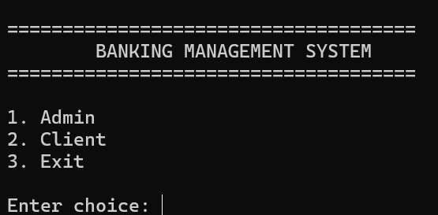
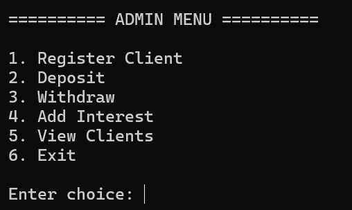
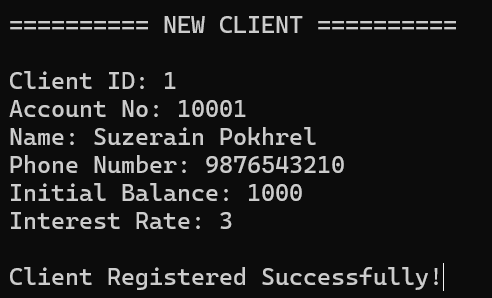
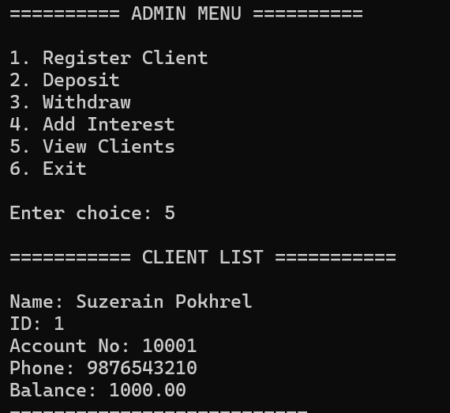
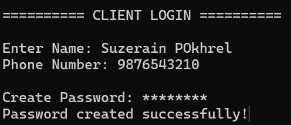
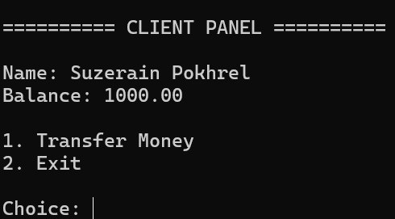
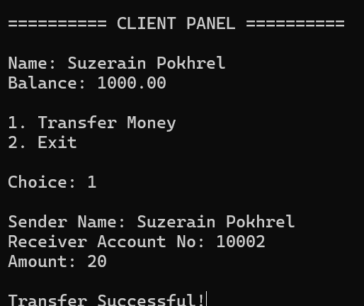

# 🏦 Banking Management System (C Project)

A console-based banking system built using C programming language with file handling, authentication, and transaction system.

---

## ✨ Features

- Admin authentication system
- Client registration system
- Secure login with password masking
- Deposit & Withdraw system
- Money transfer between accounts
- Interest calculation system
- File-based database storage

---

## 🖼️ screenshots

### 🏠 Home


### 🧑‍💼 Admin Dashboard




### 👨 Client Dashboard



### 💸 Money Transfer



---

## 🧠 Technologies Used

- C Language
- File Handling (Binary files)
- Structures
- Windows Console functions

---

## 🚀 How to Run

```bash
gcc complete.c -o bank
./bank
```

---

## 📂 Project Structure

```
Banking-System/
│
├── complete.c
├── clientPart.c
├── dummyDatabase.c
├── screenshots/
├── README.md
```

---

## 📌 Future Improvements

- Database integration (MySQL)
- GUI version (C++ / Qt)
- OTP authentication
- Transaction history logs
- Multi-user roles

---

## 👨‍💻 Author

- suzerain769
- Prashant161
- Yugal2065

---

⭐ If you like this project, give it a star!
